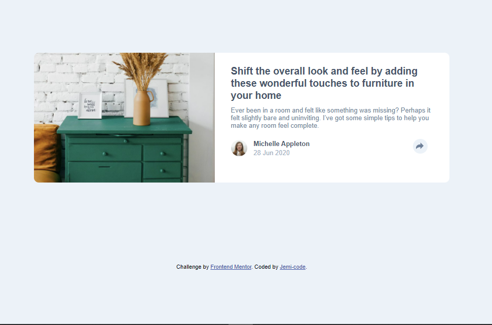

# Frontend Mentor - Article preview component solution

### Screenshot



- Solution URL: [Github](https://github.com/Jemi-code/ArcticlePreview)
- Live Site URL: [Live Site](https://jemi-code.github.io/ArticlePreview)


- Semantic HTML5 markup
- CSS custom properties
- Flexbox
- Mobile-first workflow
- Javascript

```js
let sharee = () => {
   if(icons.style.display === "none"){
    if(screen.width <= 400){
        share_area.style.backgroundColor = "hsl(217, 19%, 35%)";
    }
       icons.style.display = "block";
   }else{
    if(screen.width <= 400){
        share_area.style.backgroundColor = "white";
    }
       icons.style.display = "none";
   }
}
```

## Author

- Frontend Mentor - [@yJemi-code](https://www.frontendmentor.io/profile/Jemi-code)